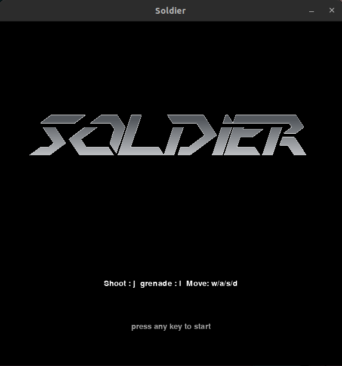
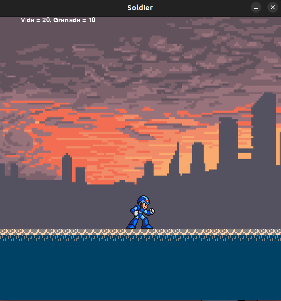
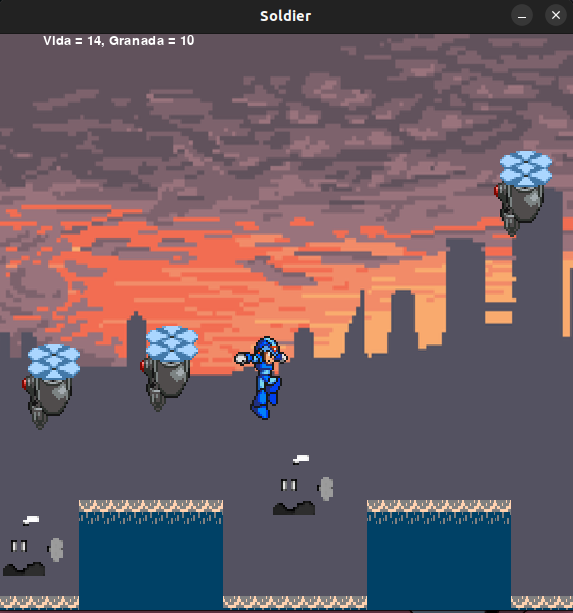

# Welcome to Project Z

Link for the original project in the official [Github Page](https://github.com/FidyBack/Projeto_Z_de_Jogo).

## About

This is a project made by a group of students from Insper, in the course of the first semester of 2018. The goal of this project is to create a game using the [Pygame](https://www.pygame.org/news) library, and to learn how to use it.

### Images

   
   

   

## Project layout

    main/
        mkdocs.yml    # The configuration file.
        docs/
            index.md  # The documentation homepage.
            ...       # Other markdown pages, images and other files.
        src/
            main.py   # The main code of the project.
            ...       # Other source files.
